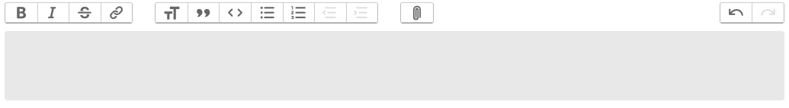

# vaadin-trix-editor

Integration of Trix editor for vaadin platform



## Development instructions

JavaScript modules can either be published as an NPM package or be kept as local 
files in your project. The local JavaScript modules should be put in 
`src/main/resources/META-INF/frontend` so that they are automatically found and 
used in the using application.

If the modules are published then the package should be noted in the component 
using the `@NpmPackage` annotation in addition to using `@JsModule` annotation.


Starting the test/demo server:
1. Run `./mvnw jetty:run`.
2. Open http://localhost:8080 in the browser.

## Publishing to Vaadin Directory

You can create the zip package needed for [Vaadin Directory](https://vaadin.com/directory/) using
```
./mvnw versions:set -DnewVersion="1.0.0" # You cannot publish snapshot versions 
./mvnw install -Pdirectory
```
